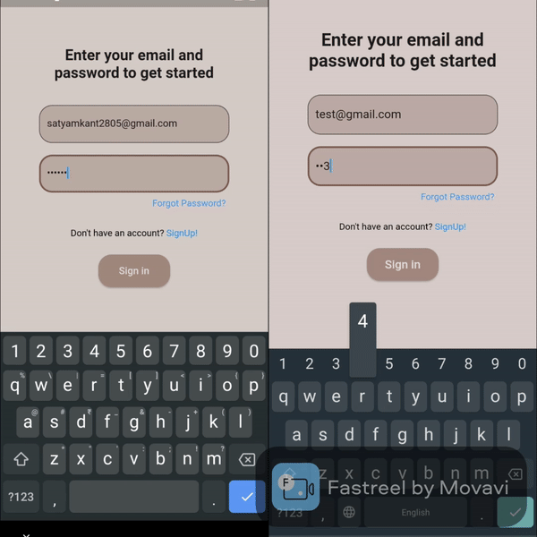

# chitchat
Chitchat, a messaging app similar to other messengers, people can send and receive messages.
To send and receive messages you first need to create an account for the app!!.

## Getting Started
  * run: git clone https://github.com/satyamkant/chit_chat in git bash cmd
  * open terminal in the cloned repo
  * run: flutter pub get in the terminal and then you are good to go...

